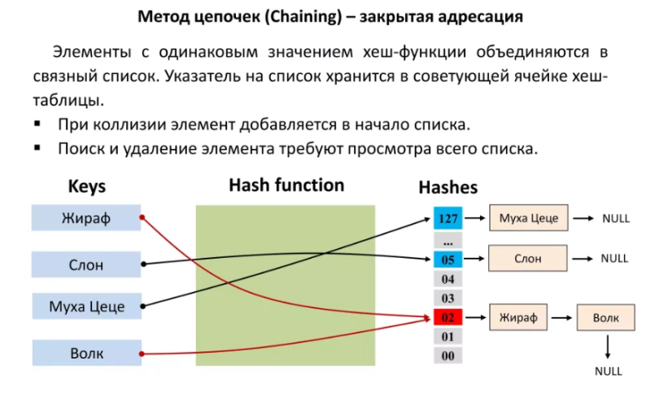
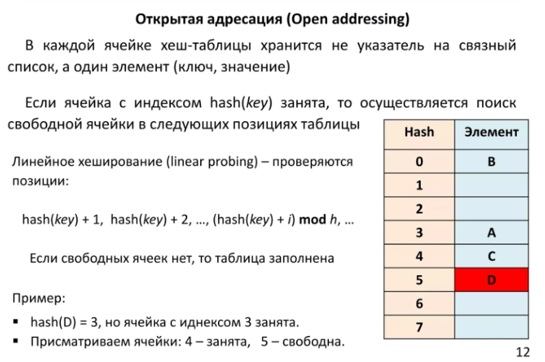

<!-- TOC start (generated with https://github.com/derlin/bitdowntoc) -->

- [Базовые алгоритмы](#h--)
    * [Факториал](#h-)
        + [Проблема](#h--1)
    * [Сортировка массива](#h---1)
        + [Проблема](#h--2)
    * [Числа Фибоначчи](#h---2)
        + [Проблема](#h--3)
    * [Проверка на палиндром](#h---3)
        + [Проблема](#h--4)
- [Prefix Sum](#h-prefix-sum)
    * [Проблема](#h--5)
    * [Объяснение](#h--6)
        + [Range Sum Query - Immutable](#h-range-sum-query-immutable)
        + [Contiguous Array](#h-contiguous-array)
        + [Subarray Sum Equals K](#h-subarray-sum-equals-k)
- [Two Pointers](#h-two-pointers)
    * [Проблема](#h--7)
    * [Объяснение](#h--8)
        + [Two Sum II - Input Array is Sorted](#h-two-sum-ii-input-array-is-sorted)
        + [3Sum](#h-3sum)
        + [Container With Most Water](#h-container-with-most-water)
- [Sliding Window](#h-sliding-window)
    * [Проблема](#h--9)
    * [Объяснение](#h--10)
        + [Maximum Average Subarray I](#h-maximum-average-subarray-i)
        + [Longest Substring Without Repeating Characters](#h-longest-substring-without-repeating-characters)
        + [Minimum Window Substring](#h-minimum-window-substring)
- [Fast & Slow Pointers](#h-fast-slow-pointers)
    * [Проблема](#h--11)
    * [Объяснение](#h--12)
        + [Linked List Cycle](#h-linked-list-cycle)
        + [Happy Number](#h-happy-number)
        + [Find the Duplicate Number](#h-find-the-duplicate-number)
- [LinkedList In-place Reversal](#h-linkedlist-in-place-reversal)
    * [Проблема](#h--13)
    * [Объяснение](#h--14)
        + [Reverse Linked List (Целиком)](#h-reverse-linked-list-)
        + [Reverse Linked List II (Частично)](#h-reverse-linked-list-ii-)
        + [Swap Nodes in Pairs](#h-swap-nodes-in-pairs)
- [Monotonic Stack](#h-monotonic-stack)
    * [Проблема](#h--15)
    * [Объяснение](#h--16)
        + [Next Greater Element](#h-next-greater-element)
        + [Daily Temperatures](#h-daily-temperatures)
        + [Largest Rectangle in Histogram](#h-largest-rectangle-in-histogram)
- [Top ‘K’ Elements](#h-top-k-elements)
    * [Проблема](#h--17)
    * [Объяснение](#h--18)
        + [Kth Largest Element in an Array](#h-kth-largest-element-in-an-array)
        + [Top K Frequent Elements](#h-top-k-frequent-elements)
        + [Find K Pairs with Smallest Sums](#h-find-k-pairs-with-smallest-sums)
- [Overlapping Intervals](#h-overlapping-intervals)
    * [Проблема](#h--19)
    * [Объяснение](#h--20)
        + [Merge Intervals](#h-merge-intervals)
        + [Insert Interval](#h-insert-interval)
        + [Non-overlapping Intervals](#h-non-overlapping-intervals)
- [Modified Binary Search](#h-modified-binary-search)
    * [Проблема](#h--21)
    * [Объяснение](#h--22)
        + [Search in Rotated Sorted Array](#h-search-in-rotated-sorted-array)
        + [Find Minimum in Rotated Sorted Array](#h-find-minimum-in-rotated-sorted-array)
        + [Search a 2D Matrix](#h-search-a-2d-matrix)
- [Binary Tree Traversal](#h-binary-tree-traversal)
    * [Проблема](#h--23)
    * [Объяснение](#h--24)
        + [Binary Tree Paths (PreOrder)](#h-binary-tree-paths-preorder)
        + [Kth Smallest Element in a BST (InOrder)](#h-kth-smallest-element-in-a-bst-inorder)
        + [Binary Tree Maximum Path Sum (PostOrder)](#h-binary-tree-maximum-path-sum-postorder)
- [Depth-First Search (DFS)](#h-depth-first-search-dfs)
    * [Проблема](#h--25)
    * [Объяснение](#h--26)
        + [Clone Graph](#h-clone-graph)
- [Breadth-First Search (BFS)](#h-breadth-first-search-bfs)
- [Matrix Traversal](#h-matrix-traversal)
- [Backtracking](#h-backtracking)
- [Dynamic Programming Patterns](#h-dynamic-programming-patterns)
- [Методы разрешения коллизий](#h---4)
    * [Разрешение коллизий с помощью цепочек](#h---5)
    * [Двойное хеширование](#h---6)

<!-- TOC end -->

<!-- TOC --><a name="h--"></a>
# Базовые алгоритмы
<!-- TOC --><a name="h-"></a>
## Факториал
<!-- TOC --><a name="h--1"></a>
### Проблема
Вычислить факториал для числа `$n`.

```php
class Solution
{
    public function factorial(int $n): int
    {
        $r = 1;
        for ($i = 2; $i <= $n; $i++) {
            $r *= $i;
        }

        return $r;
    }
}

var_dump(
    (new Solution())->factorial(5)
);

// output: int(120)
// 1 * 2 * 3 * 4 * 5 = 120
```

<!-- TOC --><a name="h---1"></a>
## Сортировка массива
<!-- TOC --><a name="h--2"></a>
### Проблема
Отсортировать массив `$nums`. (Метод сортировки выбором)

> Сложность O(n2), где n — количество элементов для сортировки.

```php
class Solution
{
    public function sortArray(array $nums): array
    {
        $result = [];
        while (count($nums) !== 0) {
            $min = null;
            $minIdx = null;

            foreach ($nums as $idx => $num) {
                if ($min === null || $num < $min) {
                    $min = $num;
                    $minIdx = $idx;
                }
            }

            $result[] = $min;
            // убираем элемент $min из массива
            array_splice($nums, $minIdx, 1);
        }

        return $result;
    }
}

var_dump(
    (new Solution())->sortArray([5, 2, 3, 1])
);

// array(4) {
//   [0] => int(1)
//   [1] => int(2)
//   [2] => int(3)
//   [3] => int(5)
// }
```

<!-- TOC --><a name="h---2"></a>
## Числа Фибоначчи
<!-- TOC --><a name="h--3"></a>
### Проблема
Числа Фибоначчи, обычно обозначаемые F(n), образуют последовательность, называемую последовательностью Фибоначчи, в которой каждое число является суммой двух предыдущих.

```php
class Solution
{
    public function fib(int $n): int
    {
        $f[0] = 0;
        $f[1] = 1;

        for ($i = 2; $i <= $n; $i++) {
            $f[$i] = $f[$i - 1] + $f[$i - 2];
        }

        return $f[$n];
    }
}

var_dump(
    (new Solution())->fib(7)
);

// output: int(13)
// $f[0] = 0
// $f[1] = 1
// $f[2] = 0 + 1 = 1
// $f[3] = 1 + 1 = 2
// $f[4] = 1 + 2 = 3
// $f[5] = 2 + 3 = 5
// $f[6] = 3 + 5 = 8
// $f[7] = 5 + 8 = 13
```

<!-- TOC --><a name="h---3"></a>
## Проверка на палиндром
<!-- TOC --><a name="h--4"></a>
### Проблема
Фраза является палиндромом, если после преобразования всех заглавных букв в строчные и удаления всех небуквенно-цифровых символов она читается одинаково и слева направо, и справа налево.

```php
class Solution
{
    public function isPalindrome(string $s): bool
    {
        $s = strtolower(str_replace(" ", "", preg_replace( '/[^a-z0-9 ]/i', '', $s)));
        // Метод двух указателей
        $right = strlen($s) - 1;
        $left = 0;

        while ($right > $left) {
            if ($s[$right] != $s[$left]) {
                return false;
            }
            $left++;
            $right--;
        }

        return true;
    }
}

var_dump(
    (new Solution)->isPalindrome('A man, a plan, a canal: Panama')
);

// output: bool(true)
// "amanaplanacanalpanama" - является полиндромом
```

<!-- TOC --><a name="h-prefix-sum"></a>
# Prefix Sum
_(Префиксные суммы)_

Prefix Sum включает предварительную обработку массива для создания нового массива, где каждый элемент в индексе i представляет сумму массива от начала до i.
Это позволяет выполнять эффективные запросы сумм на подмассивах.

Используйте этот шаблон, когда вам необходимо выполнить несколько запросов суммирования для подмассива или вычислить кумулятивные суммы.

<!-- TOC --><a name="h--5"></a>
## Проблема
Для заданного массива nums определить сумму элементов в определенном диапазоне [i, j].

```
Input: nums = [1, 2, 3, 4, 5, 6], i = 1, j = 3

Output: 9
```

<!-- TOC --><a name="h--6"></a>
## Объяснение
1. Предварительно обработайте массив A для создания массива префиксной суммы: `P = [1, 3, 6, 10, 15, 21]`.
2. Чтобы найти сумму между индексами i и j, используйте формулу: `P[j] - P[i-1]`.

<!-- TOC --><a name="h-range-sum-query-immutable"></a>
### Range Sum Query - Immutable
[Интервальные суммы](https://leetcode.com/problems/range-sum-query-immutable/description/)

```php
/**
 * $nums - целочисленный массив.
 * Задача состоит в том, чтобы вычислить сумму элементов $nums между индексами $left и $right включительно.
 */
class NumArray
{
    private array $prefix;

    /**
     * @param int[] $nums
     */
    public function __construct(array $nums)
    {
        $prefix = [reset($nums)];
        for($i = 1; $i < count($nums); $i++) {
            $prefix[] = $prefix[$i - 1] + $nums[$i];
        }
        $this->prefix = $prefix;
    }

    public function sumRange(int $left, int $right): int
    {
        return $this->prefix[$right] - $this->prefix[$left - 1];
    }
}

var_dump(
    (new NumArray([1, 2, 3, 4, 5, 6]))->sumRange(1, 3)
);

// output: int(9)
```

<!-- TOC --><a name="h-contiguous-array"></a>
### Contiguous Array
[Непрерывный массив](https://leetcode.com/problems/contiguous-array/description/)

```php
/**
 * $nums состоит только из двоичных цифр (0 и 1).
 * Задача состоит в том, чтобы найти непрерывный подмассив, в котором количество 0 и 1 одинаково, и этот подмассив должен быть самым длинным из всех таких подмассивов в данном массиве.
 * Длина этого подмассива — это то, что нам нужно вернуть.
 */
class Solution
{
    /**
     * @param int[] $nums
     */
    public function findMaxLength(array $nums): int
    {
        $map = [0 => -1];
        $total = 0;
        $maxCount = 0;

        foreach ($nums as $i => $val) {
            $val === 1 ? $total++ : $total--;

            if (isset($map[$total])) {
                $maxCount = max($i - $map[$total], $maxCount);
            } else {
                $map[$total] = $i;
            }
        }

        return $maxCount;
    }
}

var_dump(
    (new Solution())->findMaxLength([0, 1, 0, 1, 1, 0, 0])
);

// output: int(6)
```

<!-- TOC --><a name="h-subarray-sum-equals-k"></a>
### Subarray Sum Equals K
[Поиск всех подходящих под-сум](https://leetcode.com/problems/subarray-sum-equals-k/description/)

```php
/**
 * $nums - целочисленный массив. $k - целое число.
 * Задача состоит в том, чтобы вернуть общее количество подмассивов, сумма которых равна $k.
 * Количество подмассивов, сумма которых равна $k — это то, что нам нужно вернуть.
 */
class Solution
{
    private array $prefix;

    /**
     * @param int[] $nums
     */
    public function __construct(array $nums)
    {
        $prefix = [reset($nums)];
        for($i = 1; $i < count($nums); $i++) {
            $prefix[] = $prefix[$i - 1] + $nums[$i];
        }
        $this->prefix = $prefix;
    }

    public function subarraySum(int $k): int
    {
        $map = [0 => 1];
        $count = 0;

        foreach ($this->prefix as $sum) {
            $count += $map[$sum - $k] ?? 0;

            $map[$sum] = ($map[$sum] ?? 0) + 1;
        }

        return $count;
    }
}

var_dump(
    (new Solution([1, 2, 3]))->subarraySum(3)
);

// output: int(2)
// sum([1, 2]) = 3, sum([3]) = 3 => count([[1, 2], [3]]) = 2
```

<!-- TOC --><a name="h-two-pointers"></a>
# Two Pointers
_(Метод двух указателей)_

Метод «Два указателя» подразумевает использование двух указателей для итерации по массиву или списку, часто используется для поиска пар или элементов, соответствующих определенным критериям.

Используйте этот шаблон при работе с отсортированными массивами или списками, где вам нужно найти пары, удовлетворяющие определенному условию.

<!-- TOC --><a name="h--7"></a>
## Проблема
Для заданного отсортированного массива nums найти два числа, которые в сумме дают целевое значение.

```
Input: nums = [1, 2, 3, 4, 6], target = 6

Output: [1, 3] // 2 + 4 = 6
```

<!-- TOC --><a name="h--8"></a>
## Объяснение
1. Инициализируйте два указателя, один в начале (слева) и один в конце (справа) массива.
2. Проверьте сумму элементов по двум указателям:
    - Если сумма равна цели, верните индексы.
    - Если сумма меньше цели, переместите левый указатель вправо.
    - Если сумма больше цели, переместите правый указатель влево.

<!-- TOC --><a name="h-two-sum-ii-input-array-is-sorted"></a>
### Two Sum II - Input Array is Sorted
[Метод двух указателей для отсортированного массива](https://leetcode.com/problems/two-sum-ii-input-array-is-sorted/description/)

```php
/**
 * $nums - целочисленный массив, отсортированный по возрастанию.
 * Задача состоит в том, чтобы найти два числа, которые в сумме дают определенное целевое число.
 * Индексы этих чисел — это то, что нам нужно вернуть.
 */
class Solution
{
    /**
     * @param int[] $nums
     *
     * @return int[]|null
     */
    public function twoSum(array $nums, int $target): ?array
    {
        $l = 0;
        $r = count($nums) - 1;

        while ($l < $r) {
            $num = $nums[$l] + $nums[$r];

            if ($num === $target) {
                return [$l + 1, $r + 1];
            }

            $num > $target ? $r-- : $l++;
        }

        return null;
    }
}

var_dump(
    (new Solution())->twoSum([2, 3, 4], 6)
);

// output: array(2) {
//   [0] => int(1)
//   [1] => int(3)
// }
```

<!-- TOC --><a name="h-3sum"></a>
### 3Sum
[Задача о трех суммах](https://leetcode.com/problems/3sum/description/)

```php
/**
 * $nums - целочисленный массив.
 * Задача состоит в том, чтобы вернуть все триплеты [$nums[i], $nums[j], $nums[k]] такие,
 *   что i !== j, i !== k и j !== k, и $nums[i] + $nums[j] + $nums[k] === 0.
 */
class Solution
{
    /**
     * @param int[] $nums
     *
     * @return int[][]
     */
    public function threeSum(array $nums): array
    {
        $result = [];
        $n = count($nums);
        sort($nums);

        for ($i = 0; $i < $n - 2; $i++) {
            // пропускаем дубликаты и первый элемент
            if ($i > 0 && $nums[$i] === $nums[$i - 1]) {
                continue;
            }

            $left = $i + 1;
            $right = $n - 1;
            $target = 0 - $nums[$i];

            while ($left < $right) {
                $sum = $nums[$left] + $nums[$right];
                if ($sum === $target) {
                    $result[] = [$nums[$i], $nums[$left], $nums[$right]];

                    // пропускаем дубликаты для 2-го и 3-го элементов
                    while ($left < $right && $nums[$left] === $nums[$left + 1]) {
                        $left++;
                    }
                    while ($left < $right && $nums[$right] === $nums[$right - 1]) {
                        $right--;
                    }

                    $left++;
                    $right--;
                } else {
                    $sum < $target ? $left++ : $right--;
                }
            }
        }

        return $result;
    }
}

var_dump(
    (new Solution())->threeSum([-1, 0, 1, 2, -1, -4])
);

// output: array(2) {
//  [0] =>
//    array(3) {
//      [0] => int(-1)
//      [1] => int(-1)
//      [2] => int(2)
//    }
//    [1] =>
//    array(3) {
//      [0] => int(-1)
//      [1] => int(0)
//      [2] => int(1)
//    }
//  }
```

<!-- TOC --><a name="h-container-with-most-water"></a>
### Container With Most Water
[Контейнер с наибольшим количеством воды](https://leetcode.com/problems/container-with-most-water/description/)


```php
/**
 * $height - целочисленный массив.
 * Задача состоит в том, чтобы найти две линии, которые вместе с осью x образуют контейнер, так что контейнер содержит больше всего воды.
 * Максимальное количество воды, которое может хранить контейнер — это то, что нам нужно вернуть.
 */
class Solution
{
    /**
     * @param int[] $height
     */
    public function maxArea(array $height): int
    {
        $count = count($height);
        $r = 0;
        $i = 0;
        $j = $count - 1;

        while ($i < $count - 1) {
            // Если мы начнем с линий на противоположных концах и движемся внутрь,
            // единственный возможный момент, когда площадь может быть больше, — это когда высота увеличивается,
            // поскольку ширина будет непрерывно уменьшаться.
            if ($height[$i] <= $height[$j]) {
                $t = $height[$i] * ($j - $i); // площадь контейнера
                $i++;
            } else {
                $t = $height[$j] * ($j - $i); // площадь контейнера
                $j--;
            }

            if ($t > $r) {
                $r = $t;
            }
        }

        return $r;
    }
}

var_dump(
    (new Solution())->maxArea([1, 8, 6, 2, 5, 4, 8, 3, 7])
);

// output: int(49)
```

<!-- TOC --><a name="h-sliding-window"></a>
# Sliding Window
_(Скользящее окно)_

Шаблон скользящего окна используется для поиска подмассива или подстроки, удовлетворяющей определенному условию, оптимизируя временную сложность путем поддержания окна элементов.

Используйте этот шаблон при решении задач, связанных с непрерывными подмассивами или подстроками.

<!-- TOC --><a name="h--9"></a>
## Проблема
Найти максимальную сумму подмассива размера k.

```
Input: nums = [2, 1, 5, 1, 3, 2], k = 3

Output: 9 // [.., 5 + 1 + 3, ..]
```

<!-- TOC --><a name="h--10"></a>
## Объяснение

1. Начните с суммы первых k элементов.
2. Сдвиньте окно на один элемент за раз, вычитая элемент, который выходит за пределы окна, и добавляя новый элемент.
3. Отслеживайте максимальную полученную сумму.

<!-- TOC --><a name="h-maximum-average-subarray-i"></a>
### Maximum Average Subarray I
[Максимальное среднее значение подмассива](https://leetcode.com/problems/maximum-average-subarray-i/description/)

```php
/**
 * $nums - целочисленный массив.
 * Задача состоит в том, чтобы найти непрерывный подмассив, длина которого равна $k, имеющий максимальное среднее значение.
 * Максимальное среднее значение подмассива — это то, что нам нужно вернуть.
 */
class Solution
{
    /**
     * @param int[] $nums
     */
    public function findMaxAverage(array $nums, int $k): float
    {
        $sum = 0;
        $count = count($nums);

        // Изначально окно начинается с начала массива и перемещается на k - 1 элемент,
        // вычисляя среднее значение для первых k элементов.
        for ($i = 0; $i < $k; $i++) {
            $sum += $nums[$i];
        }
        $res = $sum;

        // Второй цикл начинается с элемента k и смещается вправо.
        // По мере перемещения окна элемент, покидающий окно (самый левый), вычитается из суммы,
        // а новый элемент, входящий в окно, добавляется к сумме.
        for ($i = $k; $i < $count; $i++) {
            $sum += $nums[$i] - $nums[$i - $k];
            if ($sum > $res) {
                $res = $sum;
            }
        }

        // вычисляем среднее значение
        return $res / $k;
    }
}

var_dump(
    (new Solution())->findMaxAverage([1, 12, -5, -6, 50, 3], 4)
);

// output: double(12.75)
// (12 - 5 - 6 + 50) / 4 = 12.75
```

<!-- TOC --><a name="h-longest-substring-without-repeating-characters"></a>
### Longest Substring Without Repeating Characters
[Длина самой длинной подстроки без повторяющихся символов](https://leetcode.com/problems/longest-substring-without-repeating-characters/description/)

```php
/**
 * $s - строка.
 * Задача состоит в том, чтобы найти длину самой длинной подстроки без повторяющихся символов.
 * Длина самой длинной подстроки без повторяющихся символов — это то, что нам нужно вернуть.
 */
class Solution
{
    public function lengthOfLongestSubstring(string $s): int
    {
        if (strlen($s) === 0) {
            return 0;
        }
        if (strlen($s) === 1) {
            return 1;
        }

        $chars = str_split($s);

        $i = 0; // правый указатель
        $j = 0; // левый указатель
        $max = 0;
        $seen = []; // хэш-набор

        while ($i < count($chars)) {
            $c = $chars[$i];

            // Если символ уже присутствует в наборе, это означает, что вам нужно переместить скользящее окно на 1,
            // перед этим вам нужно удалить все символы, которые находятся перед символом,
            // который уже присутствовал в окне ранее.
            while (isset($seen[$c])) {
                unset($seen[$chars[$j]]);
                $j++;
            }

            $seen[$chars[$i]] = true;

            $max = max($i - $j + 1, $max);
            $i++;
        }

        return $max;
    }
}

var_dump(
    (new Solution())->lengthOfLongestSubstring('abcabcbb')
);

// output: int(3)
```

<!-- TOC --><a name="h-minimum-window-substring"></a>
### Minimum Window Substring
[Минимальная подстрока окна](https://leetcode.com/problems/minimum-window-substring/description/)

```php
/**
 * $s - строка, $t - строка.
 * Задача состоит в том, чтобы найти минимальную подстроку в строке $s, в которой содержится каждый символ из строки $t.
 * Минимальная подстрока — это то, что нам нужно вернуть.
 */
class Solution
{
    public function minWindow(string $s, string $t): string
    {
        $hashMap = []; // хэш-набор
        $checker = [];
        foreach (str_split($t) as $val) {
            $hashMap[$val] = isset($hashMap[$val]) ? $hashMap[$val] + 1 : 1;
            $checker[$val] = 0;
        }

        $resultMin = strlen($s);
        $idxPairs = [];
        $have = 0;
        $left = $right = 0;

        while ($right < strlen($s)) {
            $letter = $s[$right];
            if (isset($hashMap[$letter])) {
                $checker[$letter] += 1;
                if ($checker[$letter] <= $hashMap[$letter]) {
                    $have++;
                }
            }
            while ($have === strlen($t)) {
                $len = $right - $left + 1;
                if ($len <= $resultMin) {
                    $resultMin = $len;
                    $idxPairs['left'] = $left;
                    $idxPairs['right'] = $right;
                }

                if (isset($hashMap[$s[$left]]) && $checker[$s[$left]] > 0) {
                    if ($checker[$s[$left]] <= $hashMap[$s[$left]]) {
                        $have--;
                    }
                    $checker[$s[$left]] -= 1;
                }
                $left++;
            }
            $right++;
        }

        if (empty($idxPairs)) {
            return '';
        }

        $result = '';
        while ($idxPairs['left'] <= $idxPairs['right']) {
            $result .= $s[$idxPairs['left']];
            $idxPairs['left']++;
        }
        return $result;
    }
}

var_dump(
    (new Solution())->minWindow('ADOBECODEBANC', 'ABC')
);

// output: string(4) "BANC"
// ADOBECODE[BANC]
//           BA C => (ABC)
```

<!-- TOC --><a name="h-fast-slow-pointers"></a>
# Fast & Slow Pointers
_(Быстрые и медленные указатели)_

Шаблон «Быстрые и медленные указатели (Черепаха и Заяц, Обнаружение цикла Флойда)» используется для обнаружения циклов в связанных списках и других подобных структурах.

<!-- TOC --><a name="h--11"></a>
## Проблема

Определить, есть ли цикл в связанном списке.

<!-- TOC --><a name="h--12"></a>
## Объяснение

1. Инициализируйте два указателя, один из которых перемещается на один шаг за раз (медленно), а другой перемещается на два шага за раз (быстро).
2. Если есть цикл, быстрый указатель в конечном итоге встретится с медленным указателем.
3. Если быстрый указатель достигает конца списка, цикла нет.

<!-- TOC --><a name="h-linked-list-cycle"></a>
### Linked List Cycle
[Цикл связанного списка](https://leetcode.com/problems/linked-list-cycle/description/)

```php
/**
 * ListNode - Класс связанного списка
 */
class ListNode
{
    public ?ListNode $next = null;
    
    public function __construct(public int $val = 0)
    {
    }
}

/**
 * $head - связанный список.
 * Задача состоит в том, чтобы найти цикл в связанном списке.
 * Наличие цикла — это то, что нам нужно вернуть.
 */
class Solution
{
    public function hasCycle(ListNode $head): bool
    {
        $slowPointer = $fastPointer = $head;
        while ($fastPointer !== null && $fastPointer->next !== null) {
            $slowPointer = $slowPointer->next; // медленный указатель перемещается на один шаг
            $fastPointer = $fastPointer->next->next; // быстрый указатель перемещается на два шага

            // если есть цикл, быстрый указатель в конечном итоге встретится с медленным указателем
            if ($slowPointer === $fastPointer) {
                return true;
            }
        }

        // если быстрый указатель достигает конца списка, цикла нет
        return false;
    }
}

$listNode0 = new ListNode(3);
$listNode1 = new ListNode(2);
$listNode2 = new ListNode(0);
$listNode3 = new ListNode(-4);

$listNode0->next = $listNode1;
$listNode1->next = $listNode2;
$listNode2->next = $listNode3;
$listNode3->next = $listNode2;

// $listNode0 - связанный список [3 -> 2 -> 0 -> -4]
//                               [     ^_________/ ]

var_dump(
    (new Solution())->hasCycle($listNode0)
);

// output: bool(true)
```

<!-- TOC --><a name="h-happy-number"></a>
### Happy Number
[Счастливое число](https://leetcode.com/problems/happy-number/description/)

```php
/**
 * $n - целочисленное число.
 * Задача состоит в том, чтобы определить, является ли число $n - счастливым.
 * Является ли число $n счастливым — это то, что нам нужно вернуть.
 *
 * Счастливое число - число, у которого сумма квадратов его цифр возвращает 1. (в цикле для каждого результата)
 */
class Solution
{
    public function isHappy(int $n): bool
    {
        $slow = $fast = $n;
        do {
            $slow = $this->powerSum($slow); // медленный указатель перемещается на один шаг
            $fast = $this->powerSum($this->powerSum($fast)); // быстрый указатель перемещается на два шага
        } while ($fast !== 1 && $fast !== $slow); // если есть цикл, быстрый указатель в конечном итоге встретится с медленным указателем

        // если быстрый указатель равен 1, число счастливое
        // если указатели равны, то число несчастливое
        return $fast === 1;
    }

    /**
     * Вычисляем сумму квадратов цифр числа
     */
    private function powerSum(int $s): int
    {
        $digits = str_split($s);
        $res = 0;

        foreach ($digits as $digit){
            $res += $digit ** 2;
        }

        return $res;
    }
}

var_dump(
    (new Solution())->isHappy(19)
);

// output: bool(true)
// 1 ** 2 + 9 ** 2 = 1 + 81 = 82 (slow 1 шаг) | 1 ** 2 + 9 ** 2 = 1 + 81 = 82   => 8 ** 2 + 2 ** 2 = 64 + 4 = 68            (fast 2 шага)
// ^        ^                 --                ^        ^                 --      ^        ^                 --
// 8 ** 2 + 2 ** 2 = 64 + 4 = 68 (slow 1 шаг) | 6 ** 2 + 8 ** 2 = 36 + 64 = 100 => 1 ** 2 + 0 ** 2 + 0 ** 2 = 1 + 0 + 0 = 1 (fast 2 шага)
// ^        ^                 --                ^        ^                  ---    ^        ^        ^                    -
```

<!-- TOC --><a name="h-find-the-duplicate-number"></a>
### Find the Duplicate Number
[Поиск повторяющегося числа](https://leetcode.com/problems/find-the-duplicate-number/description/)

```php
/**
 * $nums - целочисленный массив n + 1 (1, 2, 3.. в разном порядке), где каждое число в диапазоне [1, n]
 * Задача состоит в том, чтобы определить повторяющееся число не изменяя массив
 * Повторяющееся число в массиве или NULL, если его нет — это то, что нам нужно вернуть.
 */
class Solution {
    public function findDuplicate(array $nums): ?int
    {
        // инициализация указателей
        $slow = $nums[0];
        $fast = $nums[0];

        do {
            $slow = $nums[$slow]; // медленный указатель перемещается на один шаг
            $fast = $nums[$nums[$fast]]; // быстрый указатель перемещается на два шага
        } while ($slow !== $fast); // цикл продолжается до тех пор, пока оба указателя не встретятся в какой-то точке внутри цикла

        // после определения точки встречи внутри цикла мы повторно инициализируем медленный указатель
        $slow = $nums[0];
        // теперь оба указателя перемещаются на один шаг за раз
        // согласно алгоритму обнаружения цикла Флойда, когда оба указателя движутся с одинаковой скоростью, они в конечном итоге встретятся в начальной точке цикла
        // это и есть то самое повторяющееся число
        while ($slow !== $fast) {
            $slow = $nums[$slow];
            $fast = $nums[$fast];
        }

        return $slow;
    }
}

var_dump(
    (new Solution())->findDuplicate([4, 3, 1, 2, 2])
);

// output: int(2)
```

<!-- TOC --><a name="h-linkedlist-in-place-reversal"></a>
# LinkedList In-place Reversal
_(Перестановка связанного списка на месте)_

Шаблон «Перестановка связанного списка на месте» переворачивает части связанного списка, не используя дополнительное пространство.

Используйте этот шаблон, когда вам нужно перевернуть секции связанного списка.

<!-- TOC --><a name="h--13"></a>
## Проблема
Перевернуть подсписок связанного списка из позиции m в позицию n.

```
Input: head = [1, 2, 3, 4, 5], m = 2, n = 4

Output: [1, 4, 3, 2, 5] // 2, 3, 4 => 4, 3, 2
```

<!-- TOC --><a name="h--14"></a>
## Объяснение

1. Определите начало и конец подсписка.
2. Измените местами узлы, отрегулировав указатели.

<!-- TOC --><a name="h-reverse-linked-list-"></a>
### Reverse Linked List (Целиком)
[Переворачивание связанного списка целиком](https://leetcode.com/problems/reverse-linked-list/description/)

```php
/**
 * ListNode - Класс связанного списка
 */
class ListNode
{
    public ?ListNode $next = null;

    public function __construct(public int $val = 0)
    {
    }

    public function output(): array
    {
        $list = $this;
        $result = [$list->val];
        while ($list->next) {
            $list = $list->next;
            $result[] = $list->val;
        }

        return $result;
    }
}

/**
 * $head - связанный список.
 * Задача состоит в том, чтобы перевернуть связанный список $head.
 * Перевернутый связанный список — это то, что нам нужно вернуть.
 */
class Solution
{
    public function reverseList(ListNode $head): ListNode
    {
        if($head->next === null) {
            return $head;
        }

        $current = $head;
        $prev = null;
        // идем по связанному списку и переворачиваем узлы
        while ($current) {
            $originalNext = $current->next;
            $current->next = $prev; // в манере lock-step мы реверсируем текущий узел, указав его на предыдущий, прежде чем перейти к следующему узлу.

            $prev = $current; // $prev всегда указывает на предыдущий узел, который мы обработали
            $current = $originalNext;
        }

        return $prev;
    }
}

// [1, 2, 3, 4, 5]
$listNode0 = new ListNode(1);
$listNode1 = new ListNode(2);
$listNode2 = new ListNode(3);
$listNode3 = new ListNode(4);
$listNode4 = new ListNode(5);

$listNode0->next = $listNode1;
$listNode1->next = $listNode2;
$listNode2->next = $listNode3;
$listNode3->next = $listNode4;

var_dump(
    (new Solution())->reverseList($listNode0)->output()
);

// output: array(5) {
//   [0] => int(5)
//   [1] => int(4)
//   [2] => int(3)
//   [3] => int(2)
//   [4] => int(1)
// }
```


<!-- TOC --><a name="h-reverse-linked-list-ii-"></a>
### Reverse Linked List II (Частично)
[Переворачивание части связанного списка](https://leetcode.com/problems/reverse-linked-list-ii/description/)

```php
/**
 * ListNode - Класс связанного списка
 */
class ListNode
{
    public ?ListNode $next = null;

    public function __construct(public int $val = 0)
    {
    }

    public function output(): array
    {
        $list = $this;
        $result = [$list->val];
        while ($list->next) {
            $list = $list->next;
            $result[] = $list->val;
        }

        return $result;
    }
}

/**
 * $head - связанный список. $left - позиция, с которой нужно перевернуть список $head. $right - позиция, до которой нужно перевернуть список $head.
 * Задача состоит в том, чтобы перевернуть связанный список с позиции $left до позиции $right.
 * Связанный список с перевернутыми подсписком в позиции с $left до $right — это то, что нам нужно вернуть.
 */
class Solution
{
    public function reverseBetween(ListNode $head, int $left, int $right): ListNode
    {
        if ($left === $right) {
            return $head;
        }

        // создаем фиктивный узел $dummy и соединяем его с головой списка $head. (это позволит обработать пограничные случаи)
        $dummy = new ListNode(0);
        $dummy->next = $head;
        $prev = $dummy;

        // обходим список, пока не достигнем узла, предшествующему узлу на позиции $left.
        for ($i = 0; $i < $left - 1; $i++) {
            $prev = $prev->next;
        }

        // первый узел в подсписке [$left..$right]
        $current = $prev->next;

        // проходим по подсписку [$left..$right] и меняем узлы местами
        for ($i = 0; $i < $right - $left; $i++) {
            // меняем порядок узлов подсписка с помощью $prev и $current.
            $originalNext = $current->next;
            $current->next = $originalNext->next;
            $originalNext->next = $prev->next;
            $prev->next = $originalNext;
        }

        return $dummy->next;
    }
}

// [1, 2, 3, 4, 5]
$listNode0 = new ListNode(1);
$listNode1 = new ListNode(2);
$listNode2 = new ListNode(3);
$listNode3 = new ListNode(4);
$listNode4 = new ListNode(5);

$listNode0->next = $listNode1;
$listNode1->next = $listNode2;
$listNode2->next = $listNode3;
$listNode3->next = $listNode4;

var_dump(
    (new Solution())->reverseBetween($listNode0, 2, 4)->output()
);

// output: array(5) {
//   [0] => int(1)
//   [1] => int(4)
//   [2] => int(3)
//   [3] => int(2)
//   [4] => int(5)
// }
```

<!-- TOC --><a name="h-swap-nodes-in-pairs"></a>
### Swap Nodes in Pairs
[Меняем местами узлы связанного списка попарно](https://leetcode.com/problems/swap-nodes-in-pairs/description/)

```php
/**
 * ListNode - Класс связанного списка
 */
class ListNode
{
    public ?ListNode $next = null;

    public function __construct(public int $val = 0)
    {
    }

    public function output(): array
    {
        $list = $this;
        $result = [$list->val];
        while ($list->next) {
            $list = $list->next;
            $result[] = $list->val;
        }

        return $result;
    }
}

/**
 * $head - связанный список.
 * Задача состоит в том, чтобы поменять местами каждые два соседних узла списка $head.
 * Связанный список с измененными узлами — это то, что нам нужно вернуть.
 */
class Solution
{
    public function swapPairs(ListNode $head): ListNode
    {
        // создаем фиктивный узел $dummy и соединяем его с головой списка $head. (это позволит обработать пограничные случаи при замене первой пары)
        $dummy = new ListNode(0);
        $dummy->next = $head;
        // инициализируем указатель $cur на фиктивный узел $dummy для обхода связанного списка
        $cur = $dummy;

        // используем цикл while для итерации по списку, пока не останется хотя бы два узла для замены
        while ($cur->next !== null && $cur->next->next !== null) {
            // определяем первый ($first) и второй ($second) узлы в паре, которые нужно поменять местами
            $first = $cur->next;
            $second = $cur->next->next;

            // меняем местами узлы, изменив указатели next
            $first->next = $second->next;
            $second->next = $first;
            // обновляем $cur->next, чтобы он указывал на второй ($second) узел в паре
            $cur->next = $second;

            // перемещаем указатель $cur на следующую пару, установив его на исходный первый ($first) узел
            $cur = $first;
        }

        // возвращаем $dummy->next в качестве нового заголовка измененного связанного списка
        return $dummy->next;
    }
}

// [1, 2, 3, 4]
$listNode0 = new ListNode(1);
$listNode1 = new ListNode(2);
$listNode2 = new ListNode(3);
$listNode3 = new ListNode(4);

$listNode0->next = $listNode1;
$listNode1->next = $listNode2;
$listNode2->next = $listNode3;

var_dump(
    (new Solution())->swapPairs($listNode0)->output()
);

// output: array(5) {
//   [0] => int(2)         [1, 2, 3, 4]
//   [1] => int(1)            /     /
//   [2] => int(4)           /     /
//   [3] => int(3)         [2, 1, 4, 3]
// }
```

<!-- TOC --><a name="h-monotonic-stack"></a>
# Monotonic Stack
_(Монотонный стек)_

Шаблон «Монотонный стек» использует стек для поддержания последовательности элементов в определенном порядке (возрастающем или убывающем).

Используйте этот шаблон для задач, требующих нахождения следующего большего или меньшего элемента.

<!-- TOC --><a name="h--15"></a>
## Проблема
Найти следующий больший элемент для каждого элемента в массиве. Вывести -1, если больший элемент не существует.

```
Input: nums = [2, 1, 2, 4, 3]

Output: [4, 2, 4, -1, -1]
```

<!-- TOC --><a name="h--16"></a>
## Объяснение

1. Используйте стек, чтобы отслеживать элементы, для которых мы еще не нашли следующий больший элемент.
2. Пройдитесь по массиву и для каждого элемента извлеките элементы из стека, пока не найдете больший элемент.
3. Если стек не пуст, установите результат для индекса наверху стека на текущий элемент.
4. Поместите текущий элемент в стек

<!-- TOC --><a name="h-next-greater-element"></a>
###  Next Greater Element
[Следующий больший элемент](https://leetcode.com/problems/next-greater-element-i/description/)

```php
/**
 * $nums1 - целочисленный массив, который является подмножеством целочисленного массива $nums2.
 * Задача состоит в том, чтобы определить следующий больший элемент в $nums2 для каждого элемента $nums1. Если большего элемента нет, то вернуть -1.
 * Массив следующих больших элементов для массива $nums1 — это то, что нам нужно вернуть.
 */
class Solution
{
    public function nextGreaterElement(array $nums1, array $nums2): array
    {
        // используем стек, чтобы отслеживать элементы, для которых мы еще не нашли следующий больший элемент.
        $stack = new SplStack();

        // проходим $nums2 в обратном порядке
        for ($i = count($nums2) - 1; $i >= 0; $i--) {
            while ($stack->count() && $nums2[$i] >= $stack->top()) {
                // для каждого элемента в $nums2 мы извлекаем из стека элементы, которые меньше текущего элемента (так как они больше не могут быть «следующим большим» элементом).
                $stack->pop();
            }

            // сохраняем результат в карте $ans, где ключом является элемент, а значением — его следующий больший элемент.
            // элемент, оставшийся в стеке (если таковой имеется), будет следующим большим элементом для текущего элемента.
            // если стек пуст, следующего большего элемента нет, поэтому мы сохраняем -1.
            $ans[$nums2[$i]] = $stack->count() ? $stack->top() : -1;

            $stack[] = $nums2[$i];
        }

        // после обработки $nums2 мы просто сопоставляем каждый элемент в $nums1 с результатом, сохраненным в карте.
        for ($i = 0; $i < count($nums1); $i++) {
            $nums1[$i] = $ans[$nums1[$i]];
        }

        return $nums1;
    }
}

var_dump(
    (new Solution())->nextGreaterElement([4, 1, 2], [1, 3, 4, 2])
);

// output: array(3) {
//   [0] => int(-1)    4 => больше нет элемента в [1,3,4,2]
//   [1] => int(3)     1 => 3 больше в [1,3,4,2]
//   [2] => int(-1)    2 => конец массива
// }
```

<!-- TOC --><a name="h-daily-temperatures"></a>
### Daily Temperatures
[Дневные температуры](https://leetcode.com/problems/daily-temperatures/description/)

```php
/**
 * $temperatures - целочисленный массив, который представляет ежедневные температуры.
 * Задача состоит в том, чтобы сформировать массив с количеством дней, которые нужно подождать после i-го дня, чтобы получить более высокую температуру.
 * Массив с количеством дней, которые нужно подождать — это то, что нам нужно вернуть.
 */
class Solution
{
    public function dailyTemperatures(array $temperatures): array
    {
        // инициализируем массив $ans для хранения количества дней до более теплого дня для каждой дневной температуры.
        $ans = [];
        // инициализируем стек для отслеживания индексов.
        $stack = new SplStack();

        // выполним итерацию по каждой температуре в массиве.
        for ($i = 0; $i < count($temperatures); $i++) {
            // пока стек не пуст и текущая температура больше температуры в индексе наверху стека:
            while ($stack->count() && $temperatures[$stack->top()] < $temperatures[$i]) {
                // обновим результат для индекса наверху стека разницей между текущим индексом и индексом наверху стека.
                $ans[$stack->top()] = $i - $stack->top();
                // извлечем индекс из стека.
                $stack->pop();
            }

            // поместим текущий индекс в стек.
            $stack[] = $i;
        }

        // после итерации сформируем массив $result по массиву $ans с количеством дней до более теплого дня для каждого заданного дня.
        for ($i = 0; $i < count($temperatures); $i++) {
            $result[] = $ans[$i] ?? 0;
        }

        return $result;
    }
}

var_dump(
    (new Solution())->dailyTemperatures([73, 74, 75, 71, 69, 72, 76, 73])
);

// output: array(8) {
//   [0] => int(1)   - 73 => 74
//   [1] => int(1)   - 74 => 75
//   [2] => int(4)   - 75 => 76
//   [3] => int(2)   - 71 => 72
//   [4] => int(1)   - 69 => 72
//   [5] => int(1)   - 72 => 76
//   [6] => int(0)   - 76 => --
//   [7] => int(0)   - 73 => --
// }
```

<!-- TOC --><a name="h-largest-rectangle-in-histogram"></a>
### Largest Rectangle in Histogram
[Самый большой прямоугольник в гистограмме](https://leetcode.com/problems/largest-rectangle-in-histogram/description/)


```php
/**
 * $heights - целочисленный массив содержащий высоты столбцов гистограммы.
 * Задача состоит в том, чтобы рассчитать площадь наибольшего прямоугольника в гистограмме, где ширина каждого столбца равна 1.
 * Площадь наибольшего прямоугольника в гистограмме — это то, что нам нужно вернуть.
 */
class Solution
{
    public function largestRectangleArea(array $heights): int
    {
        // длина массива высот.
        $heightsLength = count($heights);
        // максимальная площадь, которую мы получим при прохождении по столбикам.
        $maxArea = 0;
        // стек для хранения индексов столбиков.
        $stack = new SplStack();

        // $i <= $heightsLength - один дополнительный искусственный столбик ($i === $heightsLength) с высотой 0.
        // Чтобы опустошить стек, когда достигнем последней высоты.
        for ($i = 0; $i <= $heightsLength; $i++) {
            // 0 - высота искусственного столбика в конце массива высот.
            $currHeight = $i === $heightsLength ? 0 : $heights[$i];

            // проходим по массиву высот до тех пор, пока стек не станет пустым, а текущая высота не станет меньше высоты в стеке.
            // когда мы сталкиваемся с высотой, меньшей предыдущей, мы можем сформировать из нее прямоугольник.
            while ($stack->count() && $currHeight < $heights[$stack->top()]) {
                $top = $stack->pop();
                // - 1, потому что мы находимся на текущей позиции столбца, который ниже предыдущего. А мы считаем только столбцы с нарастающей высотой.
                $width = $stack->isEmpty() ? $i : $i - $stack->top() - 1;
                $area = $heights[$top] * $width;
                $maxArea = max($maxArea, $area);
            }

            $stack->push($i);
        }

        return $maxArea;
    }
}

var_dump(
    (new Solution())->largestRectangleArea([2, 1, 5, 6, 2, 3])
);

// output: int(10) площадь прямоугольника столбцов со значениями 5 и 6
```

<!-- TOC --><a name="h-top-k-elements"></a>
# Top ‘K’ Elements
_(Топ 'K' Элементов)_

Шаблон «Топ 'K' Элементов» находит первые k наибольших или наименьших элементов в массиве или потоке данных с помощью куч или сортировки.

<!-- TOC --><a name="h--17"></a>
## Проблема
Найти k-й по величине элемент в несортированном массиве.

```
Input: nums = [3, 2, 1, 5, 6, 4], k = 2

Output: 5
```

<!-- TOC --><a name="h--18"></a>
## Объяснение

1. Используйте min-heap (SplMinHeap) размером k, чтобы отслеживать k наибольших элементов.
2. Пройдитесь по массиву, добавляя элементы в heap.
3. Если размер heap превышает k, удалите наименьший элемент из heap.
4. Корнем heap будет k-й наибольший элемент.

<!-- TOC --><a name="h-kth-largest-element-in-an-array"></a>
### Kth Largest Element in an Array
[K-й наибольший элемент в массиве](https://leetcode.com/problems/kth-largest-element-in-an-array/description/)

```php
/**
 * $nums - целочисленный массив. $k - целое число.
 * Задача состоит в том, чтобы вычислить $k-тый наибольший элемент в массиве(в отсортированном порядке).
 * $k-тый наибольший элемент — это то, что нам нужно вернуть.
 */
class Solution
{
    // решение с использованием кучи
    public function findKthLargest(array $nums, int $k): int
    {
        // инициализируем кучу с сохранением минимального элемента наверху.
        $heap = new SplMinHeap();
        for ($i = 0; $i < count($nums); $i++) {
            // вставляем элементы в кучу
            $heap->insert($nums[$i]);

            // убираем из кучи значения больше $k-того элемента.
            // в SplMinHeap при извлечении элементы удаляются в отсортированном порядке по минимальному значению.
            if ($i > $k - 1) {
                $heap->extract();
            }
        }

        // извлекаем корень кучи с наибольшим $k-тым элементом.
        return $heap->extract();
    }

    // решение с использованием сортировки
    public function findKthLargest2(array $nums, int $k): int
    {
        // сортируем массив в обратном порядке.
        rsort($nums);

        return $nums[$k - 1];
    }
}

var_dump(
    (new Solution())->findKthLargest([3, 2, 3, 1, 2, 4, 5, 5, 6], 4)
);

// output: int(4)
// k: 1 => 6
// k: 2 => 5
// k: 3 => 5
// k: 4 => 4 <==
// k: 5 => 3
// k: 6 => 3
// k: 7 => 2
// k: 8 => 2
// k: 9 => 1
```

<!-- TOC --><a name="h-top-k-frequent-elements"></a>
### Top K Frequent Elements
[Топ K частых элементов](https://leetcode.com/problems/top-k-frequent-elements/description/)

```php
/**
 * $nums - целочисленный массив. $k - целое число.
 * Задача состоит в том, чтобы вычислить $k наиболее часто встречающийся элементов в массиве.
 * $k наиболее часто встречающийся элементов — это то, что нам нужно вернуть.
 */
class Solution
{
    public function topKFrequent(array $nums, int $k): array
    {
        // инициализируем кучу с сохранением минимального элемента наверху.
        $minHeap = new SplMinHeap();
        $hash = [];

        // формируем карту частотности элементов в массиве [элемент => частотность]
        for ($i = 0; $i < count($nums); $i++) {
            $hash[$nums[$i]] = isset($hash[$nums[$i]]) ? ++$hash[$nums[$i]] : 1;
        }

        foreach ($hash as $element => $frequent) {
            // наполняем кучу кортежем [0 => частота, 1 => элемент] из карты частотности
            $minHeap->insert([$frequent, $element]);

            // убираем из кучи значения больше $k-того элемента.
            // в SplMinHeap при извлечении элементы удаляются в отсортированном порядке по минимальному значению (частоте $frequent).
            if ($minHeap->count() > $k) {
                $minHeap->extract();
            }
        }

        // формируем массив $k наиболее часто встречающийся элементов
        for ($i = 0; $i < $k; $i++) {
            // в куче кортеж [0 => частота, 1 => элемент], извлекаем элементы
            $ans[] = $minHeap->extract()[1];
        }

        return $ans;
    }
}

var_dump(
    (new Solution())->topKFrequent([1, 1, 1, 2, 2, 3], 2)
);

// output: array(2) {
//   [0] => int(2)
//   [1] => int(1)
// }
// k: 1 => 3 раза
// k: 2 => 2 раза ___<== [1, 2]
// k: 3 => 1 раз
```

<!-- TOC --><a name="h-find-k-pairs-with-smallest-sums"></a>
### Find K Pairs with Smallest Sums
[Поиск K пар с наименьшими суммами](https://leetcode.com/problems/find-k-pairs-with-smallest-sums/description/)

```php
/**
 * $nums1, $nums2 - целочисленные массивы, отсортированные по возрастанию. $k - целое число.
 * Задача состоит в том, чтобы определить пару (u, v), которая состоит из одного элемента из массива $nums1 и одного элемента из массива $nums2, с наименьшими суммами.
 * Массив с наименьшими суммами элементов размером $k из массивов $nums1 и $nums2 — это то, что нам нужно вернуть.
 */
class Solution
{
    public function kSmallestPairs(array $nums1, array $nums2, int $k): array
    {
        // инициализируем массив результатов и кучу
        $result = [];
        $heap = new SplMinHeap();

        // помещаем в кучу суммы каждого элемента в $nums1 с первым элементом в $nums2.
        foreach ($nums1 as $num) {
            // куча содержит кортеж [сумма элементов $nums1 и $nums2, индекс элемента $nums2]
            $heap->insert([$num + $nums2[0], 0]);
        }

        // Pop the smallest pair from the heap and add it to the result list
        while ($k > 0 && !$heap->isEmpty()) {
            // итеративно извлекаем наименьшую пару из кучи
            $pair = $heap->extract();
            $numsSum = $pair[0];
            $index = $pair[1];

            // добавляем наименьшую пару в список результатов
            // значение для элемента $nums1 рассчитываем вычитанием из суммы, т.к. в куче только индекс ($index) массива $nums2
            $result[] = [($nums1Elem = $numsSum - $nums2[$index]), $nums2[$index]];

            // помещаем сумму текущего элемента в $nums1 со следующим элементом в $nums2 обратно в кучу.
            if ($index + 1 < count($nums2)) {
                $heap->insert([($nums1Elem = $numsSum - $nums2[$index]) + $nums2[$index + 1], $index + 1]);
            }

            // уменьшаем число пар, чтобы вернуть результат
            $k--;
        }

        return $result;
    }
}

var_dump(
    (new Solution())->kSmallestPairs([1, 7, 11], [2, 4, 6], 3)
);

// output: array(3) {
//   [0] => array(2) {
//     [0] => int(1)    [1, 7, 11], [2, 4, 6] = 1 + 2 = 3 (наименьшая сумма)
//     [1] => int(2)     =           =
//   }
//   [1] => array(2) {
//     [0] => int(1)    [1, 7, 11], [2, 4, 6] = 1 + 4 = 5 (наименьшая сумма)
//     [1] => int(4)     =              =
//   }
//   [2] => array(2) {
//     [0] => int(1)    [1, 7, 11], [2, 4, 6] = 1 + 6 = 7 (наименьшая сумма)
//     [1] => int(6)     =                 =
//   }
// }
```

<!-- TOC --><a name="h-overlapping-intervals"></a>
# Overlapping Intervals
_(Перекрывающиеся интервалы)_

Шаблон перекрывающихся интервалов используется для объединения или обработки перекрывающихся интервалов в массиве.

В массиве интервалов, отсортированном по времени начала, два интервала `[a, b]` и `[c, d]` перекрываются, если `b >= c` (т. е. время окончания первого интервала больше или равно времени начала второго интервала).

<!-- TOC --><a name="h--19"></a>
## Проблема
Объединить все перекрывающиеся интервалы.

```
Input: intervals = [[1, 3], [2, 6], [8, 10], [15, 18]]

Output: [[1, 6], [8, 10], [15, 18]]
```

<!-- TOC --><a name="h--20"></a>
## Объяснение

1. Отсортируйте интервалы по времени начала.
2. Создайте пустой список с именем merged для хранения объединенных интервалов.
3. Пройдитесь по интервалам и проверьте, перекрывается ли он с последним интервалом в объединенном списке.
4. Если перекрывается, объедините интервалы, обновив время окончания последнего интервала в merged.
5. Если не перекрывается, просто добавьте текущий интервал в объединенный список.

<!-- TOC --><a name="h-merge-intervals"></a>
### Merge Intervals
[Объединение интервалов](https://leetcode.com/problems/merge-intervals/description/)

```php
/**
 * $intervals - массив интервалов, где интервал является массивом с левой и правой границей.
 * Задача состоит в том, чтобы объединить все пересекающиеся интервалы в массиве интервалов.
 * Массив не пересекающихся интервалов, которые покрывают все интервалы во входных данных — это то, что нам нужно вернуть.
 */
class Solution
{
    public function merge(array $intervals): array
    {
        // сортируем интервалы по времени начала.
        usort($intervals, static fn($a, $b) => $a[0] <=> $b[0]);

        // создаем пустой список для хранения объединенных интервалов.
        $mergedIntervals = [];
        $interval = $intervals[0];

        // проходим по интервалам и проверяем, пересекаются ли они с последним интервалом в объединенном списке.
        for ($i = 1; $i < count($intervals); $i++) {
            if ($interval[1] >= $intervals[$i][0]) {
                // если интервалы пересекаются, объединяем их, обновив правую границу интервала.
                $interval[1] = max($interval[1], $intervals[$i][1]);
            } else {
                // если интервалы не пересекаются, добавляем текущий интервал в объединенный список.
                $mergedIntervals[] = $interval;
                $interval = $intervals[$i];
            }
        }

        $mergedIntervals[] = $interval;

        return $mergedIntervals;
    }
}

var_dump(
    (new Solution())->merge([[1, 3], [2, 6], [8, 10], [15, 18]])
);

// output: array(3) {
//   [0] => array(2) {
//     [0] => int(1)
//     [1] => int(6)
//   }
//   [1] => array(2) {
//     [0] => int(8)
//     [1] => int(10)
//   }
//   [2] => array(2) {
//     [0] => int(15)
//     [1] => int(18)
//   }
// }
```

<!-- TOC --><a name="h-insert-interval"></a>
### Insert Interval
[Вставка интервала](https://leetcode.com/problems/insert-interval/description/)

```php
/**
 * $intervals - отсортированный в порядке возрастания массив не перекрывающихся интервалов, где интервал является массивом с левой и правой границей.
 * $newInterval - массив интервала с левой и правой границей.
 * Задача состоит в том, чтобы вставить $newInterval в $intervals так, чтобы $intervals также не имел перекрывающихся интервалов (при необходимости перекрывающиеся интервалы могут быть объединены).
 * Массив $intervals после вставки $newInterval — это то, что нам нужно вернуть.
 */
class Solution
{
    public function insert(array $intervals, array $newInterval): array
    {
        $result = [];

        // курсор-индекс по интервалам $intervals
        $i = 0;

        // получаем не перекрывающиеся интервалы $intervals до $newInterval
        while ($i < count($intervals) && $intervals[$i][1] < $newInterval[0]) {
            $result[] = $intervals[$i];
            $i++;
        }

        // объединяем перекрывающиеся интервалы
        while ($i < count($intervals) && $intervals[$i][0] <= $newInterval[1]) {
            $newInterval[0] = min($newInterval[0], $intervals[$i][0]);
            $newInterval[1] = max($newInterval[1], $intervals[$i][1]);
            $i++;
        }

        // получаем объединенный перекрывающийся интервал
        $result[] = $newInterval;

        // получаем не перекрывающиеся интервалы $intervals после $newInterval
        while ($i < count($intervals)) {
            $result[] = $intervals[$i];
            $i++;
        }

        return $result;
    }
}

var_dump(
    (new Solution())->insert([[1, 2], [3, 5], [6, 7], [8, 10], [12, 16]], [4, 8])
);

// output: array(3) {
//   [0] => array(2) {
//     [0] => int(1)
//     [1] => int(2)
//   }
//   [1] => array(2) {
//     [0] => int(3)
//     [1] => int(10)
//   }
//   [2] => array(2) {
//     [0] => int(12)
//     [1] => int(16)
//   }
// }
```

<!-- TOC --><a name="h-non-overlapping-intervals"></a>
### Non-overlapping Intervals
[Не перекрывающиеся интервалы](https://leetcode.com/problems/non-overlapping-intervals/description/)

```php
/**
 * $intervals - массив интервалов, где интервал является массивом с левой и правой границей.
 * Задача состоит в том, чтобы определить минимальное количество интервалов, которое нужно удалить, чтобы сделать остальные интервалы не перекрывающимися (соприкасающиеся интервалы - не перекрывающимися).
 * Минимальное количество интервалов, которое нужно удалить — это то, что нам нужно вернуть.
 */
class Solution
{
    public function eraseOverlapIntervals(array $intervals): int
    {
        // сортируем интервалы по их времени окончания.
        usort($intervals, static fn($a, $b) => $a[1] <=> $b[1]);

        $counter = 0;
        $prevEnd = $intervals[0][1];

        // начинаем процесс со второго интервала.
        for ($i = 1; $i < count($intervals); $i++) {
            // если текущий интервал перекрывается с предыдущим, увеличиваем счетчик.
            if ($intervals[$i][0] < $prevEnd) {
                $counter++;
            } else {
                // если текущий интервал не перекрывается, обновляем время окончания.
                $prevEnd = $intervals[$i][1];
            }
        }

        return $counter;
    }
}

var_dump(
    (new Solution())->eraseOverlapIntervals([[1, 2], [2, 3], [3, 4], [1, 3]])
);

// output: int(1)
// [1, 3] - перекрывается с интервалом [1, 2] и [2, 3]
```

<!-- TOC --><a name="h-modified-binary-search"></a>
# Modified Binary Search
_(Модифицированный бинарный поиск)_

Шаблон модифицированного бинарного поиска адаптирует бинарный поиск для решения более широкого круга задач, таких как поиск элементов в повернутых отсортированных массивах.

Используйте этот шаблон для задач, связанных с отсортированными или повернутыми массивами, где вам нужно найти определенный элемент.

<!-- TOC --><a name="h--21"></a>
## Проблема
Найти элемент в повернутом отсортированном массиве.

```
Input: nums = [4, 5, 6, 7, 0, 1, 2], target = 0

Output: 4 // [4 => 0]
```

<!-- TOC --><a name="h--22"></a>
## Объяснение

1. Выполняем бинарный поиск с дополнительной проверкой, чтобы определить, какая половина массива отсортирована.
2. Затем проверяем, находится ли цель в диапазоне отсортированной половины.
3. Если это так, то ищем в этой половине, в противном случае ищем в другой половине.

<!-- TOC --><a name="h-search-in-rotated-sorted-array"></a>
### Search in Rotated Sorted Array
[Поиск в отсортированном повернутом массиве](https://leetcode.com/problems/search-in-rotated-sorted-array/description/)

```php
/**
 * $nums - повернутый отсортированный целочисленный массив. (повернутый - смещенный индекс). $target - значение массива $nums.
 * Задача состоит в том, чтобы найти индекс значения $target или -1, если не найдено, в массиве $nums, используя бинарный поиск O(log n).
 * Индекс искомого значения $target в массиве $nums — это то, что нам нужно вернуть.
 */
class Solution
{
    public function search(array $nums, int $target): int
    {
        $left = 0;
        $right = count($nums) - 1;

        // выполняем бинарный поиск
        while ($left <= $right) {
            // определяем индекс середины массива
            $middle = floor(($left + $right) / 2);

            // если нашли, то возвращаем результат
            if ($target === $nums[$middle]) {
                return $middle;
            }

            // если левая часть отсортирована
            if ($nums[$left] <= $nums[$middle]) {
                // если левая часть содержит целевое значение
                if ($nums[$left] <= $target && $target < $nums[$middle]) {
                    $right = $middle - 1;
                } else { // если левая часть не содержит целевое значение
                    $left = $middle + 1;
                }
            } else { // если правая часть отсортирована
                // если правая часть содержит целевое значение
                if ($nums[$middle] < $target && $nums[$middle] <= $nums[$right]) {
                    $left = $middle + 1;
                } else { // если правая часть не содержит целевое значение
                    $right = $middle - 1;
                }
            }
        }

        return -1;
    }
}

var_dump(
    (new Solution())->search([4, 5, 6, 7, 0, 1, 2], 0)
);

// output: int(4)
// [4, 5, 6, 7, 0, 1, 2]
// -l-      -m-      -r-
// l = m + 1 ->[0, 1, 2]
//             -l--m--r-
//             [0]<- r = m - 1
// [0, 1, 2, 3, 4, 5, 6] pos
//              ^
//          target pos
```

<!-- TOC --><a name="h-find-minimum-in-rotated-sorted-array"></a>
### Find Minimum in Rotated Sorted Array
[Найти минимум в повернутом отсортированном массиве](https://leetcode.com/problems/find-minimum-in-rotated-sorted-array/description/)

```php
/**
 * $nums - повернутый отсортированный целочисленный массив. (повернутый - смещенный индекс).
 * Задача состоит в том, чтобы найти минимальный элемент в массиве $nums, используя бинарный поиск O(log n).
 * Значение минимального элемента массива $nums — это то, что нам нужно вернуть.
 */
class Solution
{
    public function findMin(array $nums): int
    {
        $left = 0;
        $right = count($nums) - 1;

        // выполняем бинарный поиск
        while ($left < $right) {
            // определяем индекс середины массива
            $middle = floor(($left + $right) / 2);

            // если элемент в середине больше крайнего правого элемента, то минимальный элемент находится в правой части массива.
            if ($nums[$middle] > $nums[$right]) {
                $left = $middle + 1;
            } else { // в противном случае минимальный элемент находится в левой части массива.
                $right = $middle;
            }
        }

        // возвращаем минимальный элемент.
        return $nums[$left];
    }
}

var_dump(
    (new Solution())->findMin([3, 4, 5, 1, 2])
);

// output: int(1)
//    [3, 4, 5, 1, 2]
//    -l-   -m-   -r-
// l = m + 1 ->[1, 2]
//             -l--r-
//             -m-
//             [1] r = m
//              ^
```

<!-- TOC --><a name="h-search-a-2d-matrix"></a>
### Search a 2D Matrix
[Поиск в 2D-матрице](https://leetcode.com/problems/search-a-2d-matrix-ii/description/)

```php
/**
 * $matrix - отсортированная матрица целых чисел. $target - искомое значение в матрице.
 * Задача состоит в том, чтобы найти целевое значение $target в матрице $matrix, используя эффективный метод. (Бинарный поиск)
 * Содержит ли матрица $matrix искомое значение $target (true/false) — это то, что нам нужно вернуть.
 */
class Solution
{
    public function searchMatrix(array $matrix, int $target): bool
    {
        $lenColumn = count($matrix);
        $lenRow = count($matrix[0]);

        // идем по рядам матрицы
        for ($y = 0; $y < $lenColumn; $y++) {
            $leftX = 0;
            $rightX = $lenRow - 1;

            // выполняем бинарный поиск
            while ($leftX <= $rightX) {
                // определяем индекс середины ряда матрицы
                $middleX = floor(($leftX + $rightX) / 2);
                $value = $matrix[$y][$middleX];

                // если нашли, то возвращаем результат
                if ($value === $target) {
                    return true;
                }

                // если текущее значение в матрице меньше целевого значения, то целевое значение находится в правой части ряда
                if ($value < $target) {
                    $leftX = $middleX + 1;
                } else { // в противном случае целевое значение находится в левой части ряда
                    $rightX = $middleX - 1;
                }
            }
        }

        return false;
    }
}

var_dump(
    (new Solution())->searchMatrix([
        [ 1,  4,  7, 11, 15],
        [ 2,  5,  8, 12, 19],
        [ 3,  6,  9, 16, 22],
        [10, 13, 14, 17, 24],
        [18, 21, 23, 26, 30]
    ], 5)
);

// output: bool(true)
// [ 1,  4,  7, 11, 15] y0
//  -l-     -m-     -r-
// [ 1,  4]<- r = m - 1
//  -l- -r-
//      -m-
//     [ 4]
// [ 2,  5,  8, 12, 19] y1
//  -l-     -m-     -r-
// [ 2,  5]<- r = m - 1
//  -l- -r-
//      -m-
//     [ 5]
//       ^
```

<!-- TOC --><a name="h-binary-tree-traversal"></a>
# Binary Tree Traversal
_(Обход бинарного дерева)_

Обход бинарного дерева подразумевает посещение всех узлов бинарного дерева в определенном порядке.

* Обход PreOrder (от корня до листьев): root -> left -> right
* Обход InOrder (по порядку): left -> root -> right
* Обход PostOrder (от листьев до корня): left -> right -> root

<!-- TOC --><a name="h--23"></a>
## Проблема
Выполнить симметричный обход бинарного дерева.

```
Input: root = [1, null, 2, 3]

Output: : [1, 3, 2]
```

<!-- TOC --><a name="h--24"></a>
## Объяснение

1. Обход по порядку посещает узлы в следующем порядке: левый, корень, правый.
2. Используем рекурсию или стек для обхода дерева в этом порядке.

<!-- TOC --><a name="h-binary-tree-paths-preorder"></a>
### Binary Tree Paths (PreOrder)
[Пути бинарного дерева](https://leetcode.com/problems/binary-tree-paths/description/)


```php
/**
 * TreeNode - Класс узла бинарного дерева
 */
class TreeNode
{
    public ?int $val = null;
    public ?TreeNode $left = null;
    public ?TreeNode $right = null;

    public function __construct(int $val = 0, ?TreeNode $left = null, ?TreeNode $right = null)
    {
        $this->val = $val;
        $this->left = $left;
        $this->right = $right;
    }
}

/**
 * $root - Корень бинарного дерева.
 * Задача состоит в том, чтобы сформировать все пути бинарного дерева $root от корня до листьев (PreOrder: root -> left -> right) в любом порядке.
 * Массив строк путей бинарного дерева $root — это то, что нам нужно вернуть.
 */
class Solution
{
    public function binaryTreePaths(?TreeNode $root): array
    {
        if (!$root) {
            return [];
        }

        if (!$root->left && !$root->right) {
            // лист - узел, не имеющий дочерних узлов.
            return [$root->val];
        }

        // делаем рекурсивный вызов для левого поддерева
        $left = $this->binaryTreePaths($root->left);
        // делаем рекурсивный вызов для правого поддерева
        $right = $this->binaryTreePaths($root->right);

        // объединяем корневое значение с каждым путем в левом поддереве.
        $result = [];
        foreach ($left as $path) {
            $result[] = $root->val . '->' . $path;
        }

        // объединяем корневое значение с каждым путем в правом поддереве.
        foreach ($right as $path) {
            $result[] = $root->val . '->' . $path;
        }

        return $result;
    }
}

$treeNode1 = new TreeNode(1);
$treeNode2 = new TreeNode(2);
$treeNode3 = new TreeNode(3);
$treeNode5 = new TreeNode(5);
$treeNode1->left = $treeNode2;
$treeNode1->right = $treeNode3;
$treeNode2->right = $treeNode5;

var_dump(
    (new Solution())->binaryTreePaths($treeNode1)
);

// output: array(2) {
//   [0] => string(7) "1->2->5"
//   [1] => string(4) "1->3"
// }
//
// iteration1 = 2->5
// iteration2 = 1-> . "2->5", 1->3
```

<!-- TOC --><a name="h-kth-smallest-element-in-a-bst-inorder"></a>
### Kth Smallest Element in a BST (InOrder)
[K-й наименьший элемент в BST](https://leetcode.com/problems/kth-smallest-element-in-a-bst/description/)


```php
/**
 * TreeNode - Класс узла бинарного дерева
 */
class TreeNode
{
    public ?int $val = null;
    public ?TreeNode $left = null;
    public ?TreeNode $right = null;

    public function __construct(int $val = 0, ?TreeNode $left = null, ?TreeNode $right = null)
    {
        $this->val = $val;
        $this->left = $left;
        $this->right = $right;
    }
}

/**
 * $root - Корень бинарного дерева поиска (BST). $k - целое число, наименьшее значение (индекс с 1) среди узлов дерева.
 * Задача состоит в том, чтобы найти $k-е наименьшее значение среди узлов дерева. (используя обход InOrder: left -> root -> right)
 * Значение узла дерева, являющееся $k-м наименьшим значением — это то, что нам нужно вернуть.
 */
class Solution
{
    public function kthSmallest(TreeNode $root, int $k): ?int
    {
        // используем стек для хранения узлов в дереве.
        // решение основано на свойстве BST, где значение каждого узла больше всех значений в его левом поддереве и меньше всех значений в его правом поддереве.
        $stack = new SplStack();

        // проходим по дереву, пока не найдем $k-й элемент.
        while (true) {
            // проходим левое поддерево до тех пор, пока не останется ни одного левого потомка.
            while ($root) {
                $stack[] = $root;
                $root = $root->left;
            }

            // если $k больше размера дерева, то возвращаем NULL.
            if ($stack->isEmpty()) {
                return null;
            }

            // получаем узел из стека
            $root = $stack->pop();

            // уменьшаем количество элементов, которые необходимо найти
            $k--;

            // если нашли k-й наименьший элемент, возвращаем его.
            if ($k === 0) {
                return $root->val;
            }

            // обходим правое поддерево
            $root = $root->right;
        }
    }
}

$treeNode1 = new TreeNode(5);
$treeNode2 = new TreeNode(3);
$treeNode3 = new TreeNode(6);
$treeNode4 = new TreeNode(2);
$treeNode5 = new TreeNode(4);
$treeNode6 = new TreeNode(1);

$treeNode1->left = $treeNode2;
$treeNode1->right = $treeNode3;
$treeNode2->left = $treeNode4;
$treeNode2->right = $treeNode5;
$treeNode4->left = $treeNode6;

var_dump(
    (new Solution())->kthSmallest($treeNode1, 3)
);

// output: int(3)
// 1 <- 2 <- |3 | <- 4 <- 5 <- 6
// k1   k2   |k3|   k4   k5   k6
```

<!-- TOC --><a name="h-binary-tree-maximum-path-sum-postorder"></a>
### Binary Tree Maximum Path Sum (PostOrder)
[Максимальная сумма пути бинарного дерева](https://leetcode.com/problems/binary-tree-maximum-path-sum/description/)


```php
/**
 * TreeNode - Класс узла бинарного дерева
 */
class TreeNode
{
    public ?int $val = null;
    public ?TreeNode $left = null;
    public ?TreeNode $right = null;

    public function __construct(int $val = 0, ?TreeNode $left = null, ?TreeNode $right = null)
    {
        $this->val = $val;
        $this->left = $left;
        $this->right = $right;
    }
}

/**
 * $root- Корень бинарного дерева.
 * Задача состоит в том, чтобы вычислить максимальную сумму значений узлов пути бинарного дерева.
 * Максимальная сумма значений узлов пути бинарного дерева $root — это то, что нам нужно вернуть.
 */
class Solution
{
    public function maxPathSum(TreeNode $root): int
    {
        $max = PHP_INT_MIN;
        // для вычисления используем поиск в глубину DFS (PostOrder: left -> right -> root)
        $this->dfs($root, $max);

        return $max;
    }

    private function dfs(?TreeNode $root, int &$max): int
    {
        if (!$root) {
            return 0;
        }

        // т.к. сумма отрицательных чисел только делает сумму меньше, то отрицательные суммы не рассматриваем.
        // рекурсивно вычисляем максимальную сумму для левого пути узла
        $maxL = max($this->dfs($root->left, $max), 0);
        // рекурсивно вычисляем максимальную сумму для правого пути узла
        $maxR = max($this->dfs($root->right, $max), 0);

        // вычисляем максимальную сумму пути текущего узла
        // (текущий узел + максимальная сумма для левого пути + максимальная сумма для правого пути)
        $maxBranch = $root->val + $maxL + $maxR;
        // вычисляем максимальную сумму пути при прохождении узлов
        $max = max($max, $maxBranch);

        // возвращаем максимальную сумму пути одной из ветвей узла
        return $root->val + max($maxL, $maxR);
    }
}

$treeNode1 = new TreeNode(-10);
$treeNode2 = new TreeNode(9);
$treeNode3 = new TreeNode(20);
$treeNode4 = new TreeNode(15);
$treeNode5 = new TreeNode(7);

$treeNode1->left = $treeNode2;
$treeNode1->right = $treeNode3;
$treeNode3->left = $treeNode4;
$treeNode3->right = $treeNode5;

var_dump(
    (new Solution())->maxPathSum($treeNode1)
);

// output: int(42)
//
// (9) -- (15) -- (7) -- (20) --------------------- (-10)
//                        |---(15) max                |---(9)
//                        |---(7)                     |---(20) 20 + 15 = 35 max
//                        = 20 + 15 + 7 = 42 [max]         |---(15) max
//                                                         |---(7)
//                                                         = 9 + -10 + 20 + 15 = 34 [max]
//
// max(9,  15,     7,     42,                         34) = 42
// -----------------------------------------------------------
```

<!-- TOC --><a name="h-depth-first-search-dfs"></a>
# Depth-First Search (DFS)
_(Поиск в глубину)_

Поиск в глубину (DFS) — это метод обхода, который исследует как можно дальше вниз по ветви перед возвратом.

Используйте этот шаблон для исследования всех путей или ветвей в графах или деревьях.

<!-- TOC --><a name="h--25"></a>
## Проблема
Найдите все пути от корня до листьев в бинарном дереве.

```
                1
               / \
              2   3
               \
                5
Input: root = [1, 2, 3, null, 5]


Output: : ["1->2->5", "1->3"]
```

<!-- TOC --><a name="h--26"></a>
## Объяснение

1. Используйте рекурсию или стек для обхода каждого пути от корня до листьев.
2. Записывайте каждый путь по мере обхода.

<!-- TOC --><a name="h-clone-graph"></a>
### Clone Graph
[Клонировать граф](https://leetcode.com/problems/clone-graph/description/)


```php
/**
 * Node - Класс узла графа
 */
class Node
{
    public ?int $val = null;
    /** @var Node[]|null  */
    public ?array $neighbors = null;

    public function __construct($val = 0)
    {
        $this->val = $val;
        $this->neighbors = [];
    }
}

/**
 * $node - Ссылка на узел в связном неориентированном графе.
 * Задача состоит в том, чтобы сформировать клон графа $node.
 * Клонированный граф $node — это то, что нам нужно вернуть.
 */
class Solution
{
    protected array $visited = []; // буфер с уже посещенными узлами графа.
    private array $printBuf = []; // для удобного вывода результата.

    public function cloneGraph(?Node $node): ?Node
    {
        $this->printBuf = [];

        return $node ? $this->dfs($node) : $node;
    }

    private function dfs(Node $node): Node
    {
        // если узел уже есть в буфере посещений, то возвращаем его не клонируя.
        if(isset($this->visited[$node->val])) {
            // буфер для вывода результата (не имеет отношения к алгоритму).
            if (!isset($this->printBuf[$node->val])) {
                $this->printBuf[$node->val] = array_map(static fn (Node $n) => $n->val, $node->neighbors);
            }

            return $this->visited[$node->val];
        }

        $copy = new Node($node->val); // клонируем узел.
        $this->visited[$node->val] = $copy; // добавляем копию узла в буфер посещений.

        // перебираем соседей узла, клонируя новый узел для каждого, если его еще нет в буфере посещений.
        foreach($node->neighbors as $nei) {
            $copy->neighbors[] = $this->dfs($nei);
        }

        return $copy;
    }

    public function printBuf(): array // выводим клонированный граф.
    {
        return $this->printBuf;
    }
}

$node1 = new Node(1);
$node2 = new Node(2);
$node3 = new Node(3);
$node4 = new Node(4);
$node1->neighbors[] = $node2;
$node1->neighbors[] = $node4;
$node2->neighbors[] = $node1;
$node2->neighbors[] = $node3;
$node3->neighbors[] = $node2;
$node3->neighbors[] = $node4;
$node4->neighbors[] = $node1;
$node4->neighbors[] = $node3;

($solution = new Solution())->cloneGraph($node1);
var_dump($solution->printBuf());

// output: array(4) {
//   [1] => array(2) {
//     [0] => int(2)
//     [1] => int(4)
//   }
//   [2] => array(2) {
//     [0] => int(1)
//     [1] => int(3)
//   }
//   [3] => array(2) {
//     [0] => int(2)
//     [1] => int(4)
//   }
//   [4] => array(2) {
//     [0] => int(1)
//     [1] => int(3)
//   }
// }
//
// (1) --------> (2)    (1)--(2)                 () - новый узел
// /|\            |           |---[1]            [] - уже есть в буфере посещений
//  |             |           |---(3)
//  |            \|/               |---[2]
// (4) <-------- (3)               |---(4)
//                                      |---[1]
//                                      |---[3]  исследуем граф в глубину (DFS)
//                    <-(1)--(2)--(3)--(4) <-|
```

<!-- TOC --><a name="h-breadth-first-search-bfs"></a>
# Breadth-First Search (BFS)
<!-- TOC --><a name="h-matrix-traversal"></a>
# Matrix Traversal
<!-- TOC --><a name="h-backtracking"></a>
# Backtracking
<!-- TOC --><a name="h-dynamic-programming-patterns"></a>
# Dynamic Programming Patterns
<!-- TOC --><a name="h---4"></a>
# Методы разрешения коллизий
<!-- TOC --><a name="h---5"></a>
## Разрешение коллизий с помощью цепочек

Каждая ячейка хеш-таблицы содержит указатель на список (или другую динамическую структуру данных), в котором хранятся все элементы с одинаковым хешем.



```php
class HashTable
{
    private array $buckets;
    private int $size;

    public function __construct(int $size)
    {
        $this->size = $size;
        $this->buckets = array_fill(0, $size, null);
    }

    public function insert(int $key, string $value): void
    {
        $index = $this->hash($key);
        $this->buckets[$index] = $this->buckets[$index] ?? [];

        foreach ($this->buckets[$index] as [$kvPairKey, &$vPairValue]) {
            if ($kvPairKey === $key) {
                $vPairValue = $value;
                return;
            }
        }

        $this->buckets[$index][] = [$key, $value];
    }

    public function find(int $key): ?string
    {
        $index = $this->hash($key);

        if (!isset($this->buckets[$index])) {
            return null;
        }

        foreach ($this->buckets[$index] as [$kvPairKey, $vPairValue]) {
            if ($kvPairKey === $key) {
                return $vPairValue;
            }
        }

        return null;
    }

    private function hash(int $key): int
    {
        return $key % $this->size;
    }
}

$hashTable = new HashTable(3); // уменьшаем размер таблицы для увеличения вероятности коллизий

// вставляем ключи, которые вызывают коллизии: 3 % 3 = 0, 6 % 3 = 0
$hashTable->insert(3, 'val3');
$hashTable->insert(6, 'val6'); // эти ключи имеют одинаковый остаток от деления на 3

echo 'Значение для 3: ' . $hashTable->find(3) . PHP_EOL; // выводит: val3
echo 'Значение для 6: ' . $hashTable->find(6) . PHP_EOL; // выводит: val6

// [
// # hash func: 3 % 3 === 0, 6 % 3 === 0
//     0 => [[3, 'val3'], [6, 'val6']], // идем по цепочке и сравниваем переданный ключ с первым элементом в значении списка
//     1 => null,
//     2 => null,
// ]
```

**Преимущества:**
* Простота реализации.
* Эффективность при небольшом количестве коллизий.
* Меньшая зависимость от плотности заполнения хеш-таблицы.

**Недостатки:**
* Требует дополнительной памяти для указателей в связном списке.
* Производительность может падать при большом количестве коллизий из-за длинных цепочек.

<!-- TOC --><a name="h---6"></a>
## Двойное хеширование

Метод борьбы с коллизиями, возникающими при открытой адресации, основанный на использовании двух хеш-функций для построения различных последовательностей исследования хеш-таблицы.



```php
class HashTable
{
    public array $table;
    private int $size;

    public function __construct(int $size)
    {
        $this->size = $size;
        $this->table = array_fill(0, $size, null);
    }

    private function primaryHash(int $key): int
    {
        // Простая хеш-функция для создания коллизий
        return $key % $this->size;
    }

    private function secondaryHash(int $key): int
    {
        // Вторичная хеш-функция
        return 1 + $key % $this->size;
    }

    public function insert(int $key, string $value): void
    {
        $index = $this->primaryHash($key);
        $stepSize = $this->secondaryHash($key);

        while ($this->table[$index] !== null && $this->table[$index][0] !== $key) {
            $index = ($index + $stepSize);
            var_dump($key . ' ind ' . $index);
        }


        $this->table[$index] = [$key, $value];
    }

    public function find(int $key): ?string
    {
        $index = $this->primaryHash($key);
        $stepSize = $this->secondaryHash($key);

        while ($this->table[$index] !== null) {
            if ($this->table[$index][0] === $key) {
                return $this->table[$index][1];
            }

            $index = ($index + $stepSize);
        }

        return null;
    }
}

// Пример использования
$hashTable = new HashTable(3); // уменьшаем размер таблицы для увеличения вероятности коллизий

// Эти ключи должны вызвать коллизию
$hashTable->insert(3, 'val3');
$hashTable->insert(6, 'val6'); // эти ключи имеют одинаковый остаток от деления на 3
$hashTable->insert(9, 'val9'); // эти ключи имеют одинаковый остаток от деления на 3

echo "Значение для 3: " . $hashTable->find(3) . PHP_EOL; // выводит: val3
echo "Значение для 6: " . $hashTable->find(6) . PHP_EOL; // выводит: val6
echo "Значение для 9: " . $hashTable->find(9) . PHP_EOL; // выводит: val9

// [
//     0 => [3, 'val3'], # hash func: 3 % 3 === 0 (primary)                                          |(0)
//     1 => [6, 'val6'], # hash func: 6 % 3 === 0 (primary), 1 + 6 % 3 === 1 (secondary)             | 0 + 1 = (1)
//     2 => [9, 'val9'], # hash func: 9 % 3 === 0 (primary), 1 + 9 % 3 === 1 (secondary) | 0 + 1 = 1 | 1 + 1 = (2)
// ]
```

**Преимущества:**
* Не требует дополнительной памяти для хранения указателей.
* Более компактное представление данных.

**Недостатки:**
* Производительность может значительно падать при высокой плотности заполнения таблицы.
* Требует больше вычислительных ресурсов для разрешения коллизий.
